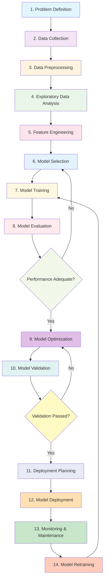

# AI Development Workflow Flowchart

## Detailed Stage Descriptions

### 1. Problem Definition
- **Objective**: Clearly define the AI problem and business requirements
- **Activities**: 
  - Identify stakeholders and their needs
  - Define success metrics and KPIs
  - Establish constraints and requirements
- **Hospital Readmission Example**: 
  - Problem: Predict patient readmission within 30 days
  - KPI: Readmission reduction rate
  - Stakeholders: Hospital administrators, healthcare providers

### 2. Data Collection
- **Objective**: Gather relevant data for the AI system
- **Activities**:
  - Identify data sources (EHRs, patient records, etc.)
  - Ensure data accessibility and quality
  - Establish data collection pipelines
- **Hospital Readmission Example**:
  - Data sources: Electronic Health Records, patient demographics
  - Dataset: 30,000 patient records
  - Features: Age, blood pressure, diabetes status, etc.

### 3. Data Preprocessing
- **Objective**: Prepare raw data for analysis
- **Activities**:
  - Handle missing values and outliers
  - Clean and normalize data
  - Convert data to appropriate formats
- **Hospital Readmission Example**:
  - Blood pressure splitting (systolic/diastolic)
  - Categorical encoding (gender, diabetes status)
  - Data normalization and scaling

### 4. Exploratory Data Analysis (EDA)
- **Objective**: Understand data patterns and relationships
- **Activities**:
  - Statistical analysis and visualization
  - Identify correlations and patterns
  - Detect data quality issues
- **Hospital Readmission Example**:
  - Readmission rate: 12.25%
  - Feature correlations with target variable
  - Class imbalance detection

### 5. Feature Engineering
- **Objective**: Create predictive features from raw data
- **Activities**:
  - Feature transformation and creation
  - Dimensionality reduction
  - Feature selection
- **Hospital Readmission Example**:
  - Age groups (Young, Middle, Senior, Elderly)
  - BMI categories (Underweight, Normal, Overweight, Obese)
  - Medical risk score calculation

### 6. Model Selection
- **Objective**: Choose appropriate ML algorithms
- **Activities**:
  - Evaluate different algorithms
  - Consider computational requirements
  - Assess interpretability needs
- **Hospital Readmission Example**:
  - Selected: Random Forest Classifier
  - Alternative: Logistic Regression
  - Criteria: Handles mixed data types, provides feature importance

### 7. Model Training
- **Objective**: Train machine learning models
- **Activities**:
  - Split data into training/validation sets
  - Configure model hyperparameters
  - Execute training process
- **Hospital Readmission Example**:
  - 70/30 train-test split with stratification
  - Class weighting for imbalance handling
  - Hyperparameter grid search

### 8. Model Evaluation
- **Objective**: Assess model performance
- **Activities**:
  - Calculate performance metrics
  - Generate confusion matrices
  - Compare against baseline models
- **Hospital Readmission Example**:
  - Metrics: Precision, recall, F1-score, ROC-AUC
  - Confusion matrix visualization
  - Cross-validation results

### 9. Model Optimization
- **Objective**: Improve model performance and efficiency
- **Activities**:
  - Hyperparameter tuning
  - Regularization techniques
  - Feature selection refinement
- **Hospital Readmission Example**:
  - Grid search for optimal n_estimators, max_depth
  - Cross-validation for robust performance
  - Feature importance analysis

### 10. Model Validation
- **Objective**: Verify model generalization capability
- **Activities**:
  - Test on holdout dataset
  - Validate against business requirements
  - Conduct ethical bias assessment
- **Hospital Readmission Example**:
  - Performance on unseen data
  - Bias testing across demographic groups
  - Clinical relevance validation

### 11. Deployment Planning
- **Objective**: Prepare for model deployment
- **Activities**:
  - Design deployment architecture
  - Develop monitoring strategy
  - Plan integration requirements
- **Hospital Readmission Example**:
  - API development for model inference
  - HIPAA compliance considerations
  - Integration with hospital EHR systems

### 12. Model Deployment
- **Objective**: Deploy model to production environment
- **Activities**:
  - Deploy trained model
  - Set up monitoring infrastructure
  - Implement user interface
- **Hospital Readmission Example**:
  - Streamlit web application deployment
  - Real-time prediction API
  - Clinician interface development

### 13. Monitoring & Maintenance
- **Objective**: Track model performance in production
- **Activities**:
  - Monitor prediction accuracy
  - Detect concept drift
  - Log system performance
- **Hospital Readmission Example**:
  - Track prediction accuracy over time
  - Monitor for concept drift in patient data
  - Continuous performance logging

### 14. Model Retraining
- **Objective**: Update model with new data
- **Activities**:
  - Collect new training data
  - Retrain model periodically
  - Validate updated performance
- **Hospital Readmission Example**:
  - Quarterly model retraining pipeline
  - Incorporate new patient data
  - Performance comparison with previous versions

## Key Features of This Workflow

### Iterative Process
- **Feedback Loops**: Each stage informs and improves subsequent stages
- **Continuous Improvement**: Models are constantly refined and updated
- **Adaptive**: Workflow adjusts based on project requirements and results

### Quality Assurance
- **Validation Points**: Multiple checkpoints to ensure quality
- **Performance Tracking**: Continuous monitoring of model effectiveness
- **Ethical Considerations**: Built-in bias detection and mitigation

### Practical Implementation
- **Scalable**: Can be adapted for different AI projects
- **Documentation**: Each stage includes specific activities and outputs
- **Real-world Examples**: Based on actual hospital readmission project implementation

This workflow demonstrates a comprehensive approach to AI development that balances technical requirements with practical deployment considerations and ethical responsibilities.