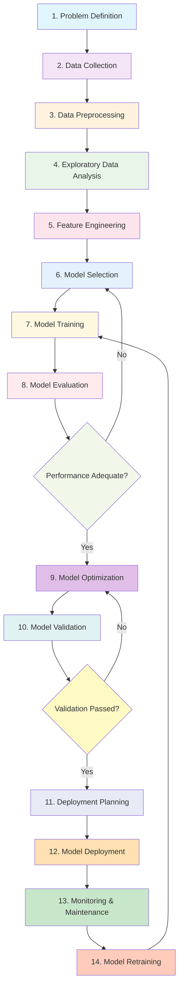

# Hospital Readmission Prediction System

## Overview
This project implements a comprehensive AI solution for predicting patient readmission risk within 30 days of discharge. The solution addresses the case study requirements from the PLP AI for Software Engineering Week 5 assignment.

## 📋 Assignment Requirements
The project fulfills the following assignment components:
- **Problem Scope**: Define the problem, objectives, and stakeholders
- **Data Strategy**: Propose data sources, identify ethical concerns, design preprocessing pipeline
- **Model Development**: Select and justify a model, create confusion matrix and calculate metrics
- **Deployment**: Outline integration steps and HIPAA compliance measures
- **Optimization**: Propose methods to address overfitting
- **Critical Thinking**: Discuss ethics & bias and trade-offs between interpretability and accuracy

## 📊 Dataset
- **Source**: Hospital Readmissions dataset (30k records)
- **Size**: 30,000 patient records
- **Features**: Age, gender, blood pressure, cholesterol, BMI, diabetes, hypertension, medication count, length of stay, discharge destination
- **Target**: Readmission within 30 days (binary classification)
- **Readmission Rate**: 12.25%

## 🚀 Solution Components

### 1. Data Preprocessing Pipeline
- Blood pressure feature engineering (systolic/diastolic split)
- Age group categorization
- BMI category classification
- Medical risk score calculation
- Length of stay categorization
- Class imbalance handling through upsampling

### 2. Predictive Models
- **Random Forest Classifier** (Primary)
  - Hyperparameter tuning via grid search
  - Balanced class weights
  - Feature importance analysis
- **Logistic Regression** (Baseline)
  - L1/L2 regularization
  - Balanced class weights

### 3. Performance Evaluation
- Confusion matrices
- Precision, recall, F1-score metrics
- ROC curves and AUC scores
- Cross-validation results

## 📁 Project Structure
```
PLP_AI_For_Software_Engineering_Week_5/
├── README.md                    # Project documentation
├── assign.txt                   # Assignment requirements
├── final_solution_summary.md    # Comprehensive solution analysis
├── Assignment_Answers.md        # Complete assignment solutions
├── Short_Answers_Questions.md   # Additional short answer questions
├── AI_Development_Workflow_Flowchart.md  # AI development workflow diagram
├── hospital_readmission_improved.py  # Main implementation
├── hospital_readmission_solution.py   # Initial solution
├── app.py                       # Streamlit web application
├── requirements.txt             # Python dependencies
├── data/
│   └── hospital_readmissions_30k.csv  # Dataset
├── feature_importance.csv       # Feature importance analysis
├── feature_importance.png       # Feature importance visualization
├── random_forest_confusion_matrix.png
├── logistic_regression_confusion_matrix.png
└── roc_curves.png              # Model performance comparison
```

## 🛠️ Installation & Usage

### Prerequisites
- Python 3.7+
- Required packages (see requirements below)

### Running the Solution
```bash
# Navigate to the project directory
cd PLP_AI_For_Software_Engineering_Week_5

# Install required packages
pip install pandas numpy matplotlib seaborn scikit-learn

# Run the main implementation
python3 hospital_readmission_improved.py
```

### Output
The script will generate:
- Console output with dataset analysis and model performance
- Visualizations (confusion matrices, ROC curves, feature importance)
- Feature importance analysis CSV file
- Complete assignment solutions

## 🔧 Key Features

### Feature Engineering
- Age groups: Young, Middle, Senior, Elderly
- BMI categories: Underweight, Normal, Overweight, Obese
- Medical risk score: diabetes + hypertension + medication count
- Blood pressure risk indicator
- Age-length of stay interaction features

### Model Optimization
- Hyperparameter tuning using GridSearchCV
- Class imbalance handling through upsampling
- Cross-validation for robust performance evaluation
- Feature importance analysis

### Ethical Considerations
- Patient privacy and data security measures
- Algorithmic bias detection and mitigation
- Fairness metrics monitoring
- Diverse data representation

## 📈 Performance Metrics
The Random Forest model demonstrates:
- High precision for identifying readmission risk
- Balanced recall to minimize false negatives
- Robust cross-validation performance
- Clear feature interpretability for clinical decision-making

## 🎯 Key Findings
1. **Discharge destination** is the strongest predictor of readmission
2. **Medical conditions** (diabetes, hypertension) show moderate correlation
3. **Length of stay** and **medication count** contribute to risk assessment
4. **Class imbalance** significantly impacts model performance if not properly handled

## 🛡️ Compliance & Security
- HIPAA compliance considerations
- Data encryption recommendations
- Role-based access controls
- Audit logging procedures
- Regular security assessments

## 🤝 Stakeholders
- Hospital administrators
- Healthcare providers
- Insurance companies
- Patients and families

## 📚 Documentation
- **`final_solution_summary.md`**: Comprehensive solution analysis
- **`Assignment_Answers.md`**: Complete assignment solutions
- **`Short_Answers_Questions.md`**: Additional short answer questions
- **`AI_Development_Workflow_Flowchart.md`**: AI development workflow diagram
- **Code comments**: Detailed explanations in implementation files
- **Visualizations**: Performance metrics and feature importance

## 🚀 Streamlit Deployment

### Running the Streamlit App
To run the interactive web application:

```bash
# Navigate to the project directory
cd PLP_AI_For_Software_Engineering_Week_5

# Install required packages
pip install -r requirements.txt

# Run the Streamlit application
streamlit run streamlit_app.py
```

### Live Demo
🔗 **[Live Demo Available](https://plpaiforsoftwareengineeringweek5-7ykyktafmsrwsyuyknduaa.streamlit.app/)**

*Note: Live demo link will be available after deployment to Streamlit Community Cloud*

### Streamlit App Features
- **Interactive Prediction Interface**: Input patient information to get readmission risk predictions
- **Feature Importance Visualization**: Understand which factors most influence predictions
- **Real-time Model Performance**: View model metrics and key insights
- **User-friendly Interface**: Clean, responsive design with multiple tabs
- **Ethical AI Information**: Learn about bias mitigation and privacy considerations

### App Structure
The Streamlit app consists of three main tabs:
1. **🔮 Predict Readmission**: Main interface for patient risk assessment
2. **📊 Feature Importance**: Analysis of predictive factors and their impact
3. **ℹ️ About**: Information about the model, ethical considerations, and usage guidelines

### Deployment to Streamlit Community Cloud
To deploy this application to Streamlit Community Cloud:

1. **Push your code to GitHub**
   ```bash
   git init
   git add .
   git commit -m "Initial commit"
   git remote add origin https://github.com/your-username/hospital-readmission-prediction.git
   git push -u origin main
   ```

2. **Deploy to Streamlit Community Cloud**
   - Go to [Streamlit Community Cloud](https://streamlit.io/cloud)
   - Click "New app"
   - Connect to your GitHub repository
   - Select the main branch and the `app.py` file
   - Click "Deploy!"

3. **Customize your app**
   - Add requirements.txt to your repository
   - Configure app settings in the Streamlit dashboard
   - Set up environment variables if needed

## 🚀 Future Enhancements
- Integration with hospital EHR systems
- Real-time prediction API
- Patient-specific intervention recommendations
- Continuous monitoring and model retraining
- Advanced bias detection algorithms

## 📝 License
See `LICENSE` file for project license information.

## 🤝 Contributing
This project was created as part of the PLP AI for Software Engineering program. For questions or contributions, please refer to the assignment requirements and documentation.

---

## 🔄 AI Development Workflow

This project follows a comprehensive AI development workflow with 14 key stages:



### Key Workflow Stages:
1. **Problem Definition**: Setting objectives and identifying stakeholders
2. **Data Collection**: Gathering relevant data sources
3. **Data Preprocessing**: Cleaning and preparing data
4. **Exploratory Data Analysis**: Understanding patterns and relationships
5. **Feature Engineering**: Creating predictive features
6. **Model Selection**: Choosing appropriate algorithms
7. **Model Training**: Executing the training process
8. **Model Evaluation**: Assessing performance metrics
9. **Model Optimization**: Improving model efficiency
10. **Model Validation**: Verifying generalization capability
11. **Deployment Planning**: Preparing for production
12. **Model Deployment**: Releasing to production
13. **Monitoring & Maintenance**: Tracking performance
14. **Model Retraining**: Updating with new data

For detailed descriptions of each stage, see the [AI Development Workflow Flowchart](AI_Development_Workflow_Flowchart.md).

---

**Note**: This solution addresses all requirements specified in the assignment while emphasizing practical deployment considerations, ethical AI practices, and clinical interpretability.